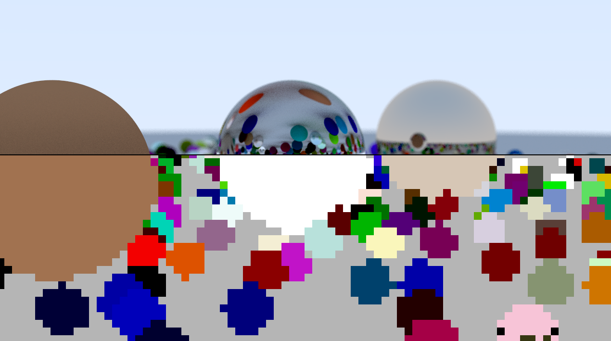

## Build & Run

`cmake --build build`
`build\Debug\OfflineRayTracer > image.ppm`

## Controls

- WASD - Flight controls
- QE - Up / Down
- Mouse Drag + Click - Look
- Spacebar - Full Render
- Tab or mouse click - Preview

## Config

set `outputPPM = true` in `main()` for output image